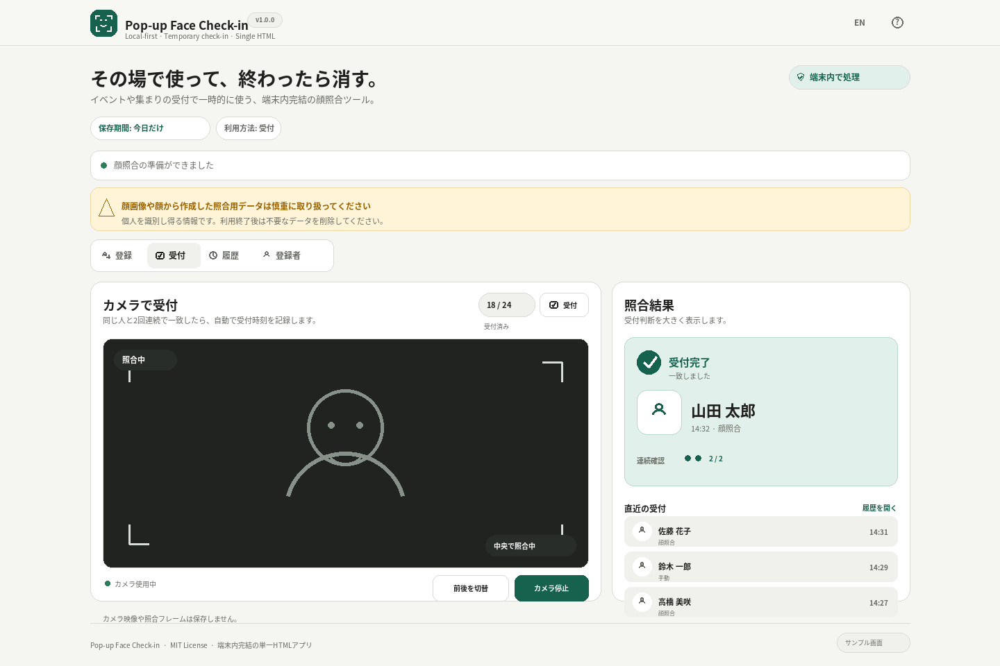

# Pop-up Face Check-in

[](https://github.com/ttomohisa/htmlapps-popup-face-check-in/actions/workflows/deploy-pages.yml)
[](LICENSE)
[](https://ttomohisa.github.io/htmlapps-popup-face-check-in/)

[English README](README.md)

イベントや集まりの受付で一時的に使う、**端末内完結・単一HTMLの顔照合受付ツール**です。参加者を事前登録し、当日はカメラで受付。うまく照合できないときは手動受付へ切り替え、イベント終了後は顔データをまとめて削除できます。

**その場で使って、終わったら消す。** を基本コンセプトにしています。顔照合はブラウザ内で行い、登録写真やカメラ映像をアプリのサーバーへアップロードしません。

## 🚀 Live demo

### [GitHub PagesでPop-up Face Check-inを開く](https://ttomohisa.github.io/htmlapps-popup-face-check-in/)

GitHub Pagesから最初のHTMLを取得した後、顔検出・特徴抽出・照合・登録・履歴管理・出力は端末内で処理します。配布用の単一HTMLには、必要なランタイムとモデルも内包されます。

[](https://ttomohisa.github.io/htmlapps-popup-face-check-in/)

## 主な機能

- **サーバーなしで受付** — 顔検出・顔照合はブラウザ内で完結。アカウント、バックエンド、分析基盤、クラウドDBは不要です。
- **実際の受付運用を想定** — 複数人の一括登録、1人最大3件の照合用データ、登録者検索、顔照合できない場合の手動受付に対応しています。
- **受付 / 入退場を選択** — 1人1回の受付だけでなく、入場・退場・再入場を時系列で残すモードも選べます。
- **ミスから戻しやすいUI** — 受付取消、登録者削除、追加した照合用データの削除には確認を入れ、安全に戻せる操作はUndoできます。
- **登録情報を端末間で持ち運び** — パスワードで保護した `.popupface` ファイルに登録情報を保存し、受付履歴とは分離したまま別端末へ読み込めます。
- **保存期間を明確に選択** — 「今日だけ / ブラウザを閉じるまで / 手動で削除」から選び、最後は顔関連データをまとめて削除できます。

## Quick start

### Web版を使う

[GitHub Pages版](https://ttomohisa.github.io/htmlapps-popup-face-check-in/)を開くだけです。インストールやアカウント登録は不要です。

カメラ利用には安全なコンテキストが必要です。GitHub PagesはHTTPSのため、対応ブラウザで通常どおりカメラ権限を許可できます。

### 完全内包の単一HTMLを作る

1. このリポジトリをダウンロードまたはcloneします。
2. Windowsで `setup-assets.bat` を一度実行し、固定バージョンのランタイムとモデルを取得します。
3. `build-standalone.bat` を実行します。
4. 生成された `dist/index.html` を必要な場所へコピーします。
5. そのHTMLファイル1つを対応ブラウザで開きます。

PythonやNode.jsは不要です。セットアップとビルドにはWindows PowerShellを利用します。

### ローカル確認

```bat
start-local.bat
```

表示されたローカルURLを開いてください。`localhost` はモダンブラウザで安全なコンテキストとして扱われるため、開発時もカメラを利用できます。

## 使い方

1. セッション開始時に **「受付」または「入退場」** を選びます。
2. 保存期間を **「今日だけ / ブラウザを閉じるまで / 手動で削除」** から選びます。
3. 参加者の顔写真を登録します。1人につき最大3件の照合用データを持てます。登録元画像は処理後に保持しません。
4. 受付モードでカメラを開始します。同じ人物が2回連続で一致した場合に自動受付します。
5. 顔照合がうまくいかない場合は、受付画面から登録者を名前検索して手動受付できます。
6. 直近の受付や履歴を確認します。受付取消や入退場記録の取消は確認後に行い、直後ならUndoできます。
7. 必要に応じて受付履歴をCSV / JSONで保存します。顔画像や照合用データは出力しません。
8. イベント終了後は **「すべての顔データを削除」** を実行し、不要な `.popupface` ファイルも削除してください。

### 受付と入退場

**受付**は、1人につき最初の受付時刻を1回だけ保存します。あとから同じ人を照合しても時刻を上書きしません。

**入退場**は、入場・退場・再入場を時系列で何度でも記録します。同じ顔がカメラに映り続けて「入場 → 即退場」と連続記録されないよう、記録後は一度その顔が画面から外れるまで同じ人の自動記録を止めます。

### 判定設定

通常画面では **「見つけやすい / 標準 / 慎重」** の3プリセットだけを見せ、必要な場合のみ詳細な一致度・候補差の設定を開けます。

初期値は次のとおりです。

- 一致しきい値: `0.50`
- Top1 − Top2 margin: `0.06`
- 自動受付: 同一人物が `2回連続` で一致
- カメラ推論間隔: 約 `0.8秒`

本番利用前に、実際のカメラ・照明・登録写真で確認してください。

## 登録データの保存・読み込み

登録者画面から、用途の異なる2種類のファイルを保存できます。

### 参加者リストCSV

名前だけを保存します。顔画像、照合用データ、受付履歴は含みません。

### 暗号化した `.popupface` 登録データ

以下を含みます。

- 名前
- 代表用の小さな顔画像
- 1人最大3件の照合用データ
- ファイル形式 / 照合モデルの互換性情報

受付履歴は意図的に含めません。

保存時はブラウザ標準のWeb Crypto APIを使ってパスワードで保護します。パスワード自体はアプリに保存しません。読み込み前にファイル形式と現在の照合方式との互換性を確認し、既存登録がある場合は **「追加 / 置き換え」** を選べます。

`.popupface` には個人を識別し得る情報が含まれます。必要以上に共有・長期保管せず、不要になったらファイル自体も削除してください。

## GitHub Pagesで公開する

このリポジトリには、単一HTMLをビルドしてGitHub Pagesへ公開するworkflowを含めます。

1. `htmlapps-popup-face-check-in` としてGitHubへpushします。
2. **Settings → Pages → Build and deployment → Source** で **GitHub Actions** を選びます。
3. 開発時は必要に応じて `setup-assets.bat` で固定バージョンのランタイム / モデルを準備します。
4. `main` へpushするか、Actionsから **Deploy standalone app to GitHub Pages** を手動実行します。
5. 成功すると `https://ttomohisa.github.io/htmlapps-popup-face-check-in/` で利用できます。

## 開発・ビルド構成

[`ttomohisa/htmlapps-template`](https://github.com/ttomohisa/htmlapps-template) に準拠し、編集対象と生成物を分離しています。

```text
.
├─ src/index.template.html       # アプリ本体の編集対象
├─ app.config.json               # アプリ / ビルド設定
├─ dependencies.json             # ランタイム / モデルのメタデータ
├─ setup-assets.bat              # 固定したORT / モデルを取得
├─ build-standalone.bat          # Windows用ビルド入口
├─ build-standalone.ps1          # 単一HTMLビルダー
├─ scripts/                      # セットアップ・検証・テンプレート用ツール
├─ components/                   # htmlapps-template共通UIの参照実装
├─ assets/
│  ├─ screenshot.png
│  └─ screenshot-mobile.png
└─ dist/index.html               # 生成される単一HTML
```

`dist/` の生成物は直接編集せず、`src/index.template.html`、設定、ビルドスクリプトを変更します。

### ランタイム / モデルの準備

```bat
setup-assets.bat
```

公式YuNet / SFaceモデルは取得後に検証します。現在の推論ランタイムは **ONNX Runtime Web 1.22.0** で、実行時にOpenCV.jsは使用しません。

### 単一HTML生成

```bat
build-standalone.bat
```

ONNX Runtime Web / WASM / YuNet / SFaceを `dist/index.html` に内包します。容量削減効果がある大きなアセットはgzipで内包し、起動時に `DecompressionStream` で端末内展開します。

ビルド時には `dist/build-size-report.json` も生成し、意図しない容量増加を確認できます。

## プライバシーと実行時通信

小さな顔画像や顔から作成した照合用データは、個人を識別し得る情報として慎重に扱う必要があります。

このアプリでは次の方針を取っています。

- 登録元画像は端末内で処理し、登録完了後に保持しません。
- 2枚目・3枚目の追加写真も、照合用データを作成した後は保持しません。
- カメラ映像や照合中のフレームは保存しません。
- 顔照合用データをアプリのサーバーへ送信しません。
- 受付履歴CSV / JSONに顔画像や照合用データを含めません。
- `.popupface` はパスワードで保護し、受付履歴は含めません。
- 「すべての顔データを削除」で、登録者・代表画像・照合用データ・受付状態を端末内ストレージから削除します。

配布用単一HTMLでは通常のHTTP/HTTPS実行時通信を遮断します。CSPでは `blob:` のみ許可していますが、これはHTML内に埋め込んだONNX Runtime WASMを起動するために必要なものです。外部HTTP/HTTPSリソースの取得を許可するものではありません。

利用前に、利用目的・必要性・同意の要否・組織内ルールなど、利用環境で必要な取り扱いを確認してください。

## 制限事項

- 一時的なイベント受付・参加確認向けです。法的な本人確認、セキュリティゲートなど、高い保証が必要な本人確認用途を目的としていません。
- 顔照合には誤一致や見逃しがあり得ます。失敗時のために手動受付を用意しています。
- 精度は照明、カメラ品質、顔の向き、表情、登録写真、判定設定に影響されます。
- 1人最大3件の照合用データは角度・表情の違いへの対応を助けますが、あらゆる条件での一致を保証しません。
- ブラウザのサイトデータ削除、プライベートブラウズ、端末ポリシーなどでローカルデータが消える場合があります。持ち運びが必要な登録情報はファイルに保存してください。
- 「ブラウザを閉じるまで」はブラウザのsessionStorageの挙動に依存します。セッション復元などの影響を避け、確実に消したい場合は明示的に全削除してください。
- 利用できるカメラやカメラ切替の挙動はブラウザ・OS・端末によって異なります。

## Dependencies

| Component | Version | License | 用途 |
| --- | ---: | --- | --- |
| ONNX Runtime Web | 1.22.0 | MIT | ブラウザ内ONNX推論 |
| YuNet | 2026may | Apache-2.0 | 顔検出・ランドマーク取得 |
| SFace INT8 | 2021dec-int8 | Apache-2.0 | 顔照合用の特徴抽出 |

顔の位置合わせ、YuNet後処理、Cosine similarityによる照合、保存、暗号化、UIはブラウザ標準APIとJavaScript / Canvasで実装しています。詳細は [THIRD_PARTY_NOTICES.md](THIRD_PARTY_NOTICES.md) を参照してください。

## Contributing

不具合報告や機能提案はGitHub Issuesから歓迎します。開発方針は [CONTRIBUTING.md](CONTRIBUTING.md)、アプリの仕様契約は [APP_SPEC.md](APP_SPEC.md) を参照してください。

## License

Copyright © 2026 ttomohisa

[MIT License](LICENSE) で公開しています。
