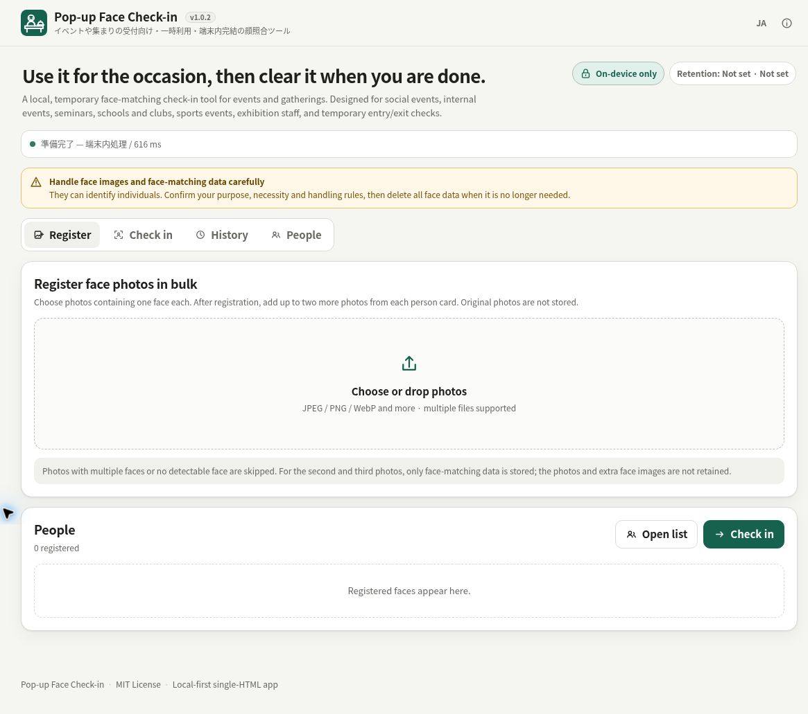

# Pop-up Face Check-in

[](https://github.com/ttomohisa/htmlapps-popup-face-check-in/actions/workflows/deploy-pages.yml)
[](LICENSE)
[](https://ttomohisa.github.io/htmlapps-popup-face-check-in/)

[日本語版 README](README.ja.md)

A privacy-focused, single-HTML face-matching check-in app for temporary events and gatherings. Register participants, match faces at reception, fall back to manual check-in when needed, and remove the data when the event is over.

**Use it on the spot, then remove the data when you are done.** Face matching runs locally in the browser. The app does not upload registration photos or camera frames to a server.

## 🚀 Live demo

### [Open Pop-up Face Check-in on GitHub Pages](https://ttomohisa.github.io/htmlapps-popup-face-check-in/)

GitHub Pages delivers the initial HTML. After it loads, face detection, feature extraction, matching, registration, history, and export are processed locally on your device. Runtime/model assets are embedded in the generated standalone HTML.

[](https://ttomohisa.github.io/htmlapps-popup-face-check-in/)

The screenshot shows English mode before a session starts, with no registered people. The static subtitle and initialization status retain their existing Japanese text.

## Features

- **Run reception without a server** — Face detection and matching stay in the browser, with no account, backend, analytics, or cloud database required.
- **Register once and handle real reception flow** — Add participants in batches, keep up to three matching samples per person, search the list, and use manual check-in when face matching is difficult.
- **Choose check-in or entry/exit tracking** — Record one-time attendance or repeated entry, exit, and re-entry events from the same app.
- **Recover from mistakes safely** — Check-in cancellation, participant deletion, and matching-data removal use clear confirmation and Undo where recovery is safe.
- **Carry registration data between devices** — Save encrypted `.popupface` registration files with password protection, then import them on another device without including attendance history.
- **Keep retention explicit** — Choose today only, until the browser closes, or until manually deleted, with a dedicated command to remove all face-related data.

## Quick start

### Use the web demo

Open the [GitHub Pages demo](https://ttomohisa.github.io/htmlapps-popup-face-check-in/). No installation or account is required.

Camera access requires a secure context. GitHub Pages uses HTTPS, so modern browsers can request camera permission normally.

### Build a fully standalone HTML file

1. Download or clone this repository.
2. Double-click `setup-assets.bat` on Windows once to download the pinned runtime and models.
3. Double-click `build-standalone.bat`.
4. Copy `dist/index.html` wherever you need it.
5. Open that single HTML file in a current browser.

Python and Node.js are not required. The setup/build scripts use Windows PowerShell.

### Local development

Run:

```bat
start-local.bat
```

Then open the local URL printed by the script. `localhost` is treated as a secure context by modern browsers, so camera access is available during development.

## Usage

1. Start a session and choose **Check-in** or **Entry / Exit**.
2. Choose how long data should remain: **Today only**, **Until the browser closes**, or **Delete manually**.
3. Register participant photos. One person can have up to three matching samples; original registration photos are not retained by the app after processing.
4. Open Reception mode and start the camera. The app confirms the same person twice before automatic face-based check-in.
5. If matching does not work well, search the registered-person list and check the person in manually without leaving the reception workflow.
6. Review recent activity and history. Search history by name, filter by All / Manual / Face matching, and check the shown/total count. Check-in or entry/exit records can be cancelled after confirmation, with Undo immediately afterward.
7. Export all attendance history as CSV or JSON when needed. History filters affect only the displayed list; both exports always include every record in the session. These exports do not include face thumbnails or face-matching data.
8. When the event is finished, use **Delete all face data** and remove any exported `.popupface` file you no longer need.

### Check-in and Entry / Exit modes

**Check-in** stores the first attendance time for each person and does not overwrite it on later matches.

**Entry / Exit** records repeated entry, exit, and re-entry events in chronological order. After recording a person, automatic matching for that same person is temporarily locked until their face leaves the camera view, preventing an immediate entry → exit pair from one continuous appearance.

Manual entry/exit ignores repeated activations for the same person while their save is pending. You can still record another person, or record a later exit after the entry finishes saving.

### Matching settings

The normal UI exposes three presets: **Easy to find**, **Standard**, and **Cautious**. Detailed similarity and margin controls are available only when needed.

The default behavior uses:

- Similarity threshold: `0.50`
- Top1 − Top2 margin: `0.06`
- Automatic check-in: the same person must match `2 consecutive times`
- Camera inference interval: approximately `0.8 seconds`

Test with the actual cameras, lighting, and registration photos you plan to use before a real event.

## Registration data files

The Registered People screen provides two different exports.

### Participant list CSV

Contains names only. It does **not** include face thumbnails, matching data, or attendance history.

### Encrypted `.popupface` registration file

Contains:

- Participant names
- A small representative face thumbnail
- Up to three face-matching data records per person
- Format/model compatibility metadata

Attendance history is intentionally excluded.

The file is protected with a password using the browser's Web Crypto API. The password is not stored by the app. Import checks the file format and matching-model compatibility before adding data. When existing registration data is present, you can choose **Add** or **Replace**.

Because `.popupface` files contain data that can be used to identify people, treat them as sensitive files. Avoid unnecessary sharing or long-term storage, and delete them when they are no longer needed.

## Publish with GitHub Pages

The repository includes a workflow that builds the standalone HTML and deploys it to GitHub Pages.

1. Push the repository to GitHub as `htmlapps-popup-face-check-in`.
2. Open **Settings → Pages → Build and deployment → Source** and select **GitHub Actions**.
3. Run `setup-assets.bat` locally when developing, or let the repository workflow prepare the required build inputs as configured.
4. Push to `main`, or manually run **Deploy standalone app to GitHub Pages** from the Actions tab.
5. After a successful deployment, the app is available at `https://ttomohisa.github.io/htmlapps-popup-face-check-in/`.

## Development and build layout

The repository follows [`ttomohisa/htmlapps-template`](https://github.com/ttomohisa/htmlapps-template) and keeps the application source separate from generated output.

```text
.
├─ src/index.template.html       # Application source
├─ app.config.json               # App/build configuration
├─ dependencies.json             # Runtime/model metadata
├─ setup-assets.bat              # Download pinned ORT/model assets
├─ build-standalone.bat          # Windows build entry point
├─ build-standalone.ps1          # Standalone HTML builder
├─ scripts/                      # Setup, verification, and template tooling
├─ components/                   # Reusable htmlapps-template UI references
├─ assets/
│  ├─ screenshot.png
│  └─ screenshot-mobile.png
└─ dist/index.html               # Generated single-HTML artifact
```

Do not edit generated files in `dist/` directly. Update `src/index.template.html`, configuration, or build scripts instead.

### Update runtime and models

Runtime/model versions are pinned by the repository configuration and setup script. Run:

```bat
setup-assets.bat
```

The setup verifies the official YuNet and SFace model files before use. The current runtime is ONNX Runtime Web 1.22.0; OpenCV.js is not included at runtime.

### Standalone build

```bat
build-standalone.bat
```

The build embeds ONNX Runtime Web, WASM, YuNet, and SFace into `dist/index.html`. Large assets are gzip-packed when it materially reduces size and are expanded locally with `DecompressionStream` at startup.

The build also writes `dist/build-size-report.json` so size regressions can be reviewed.

## Privacy and runtime network protection

Face thumbnails and face-derived matching data can identify people and should be handled carefully.

The app is designed so that:

- Registration source photos are processed locally and not retained after registration.
- Additional second/third registration photos are discarded after their matching data is created.
- Camera frames and live matching frames are not saved.
- Face matching data is not sent to an application server.
- Attendance CSV/JSON exports exclude face thumbnails and matching data.
- `.popupface` exports are password-protected and exclude attendance history.
- A complete face-data deletion action removes registered people, thumbnails, matching data, and attendance state from the app's local/session storage.

The standalone build blocks normal HTTP/HTTPS runtime connections. `blob:` is allowed by Content Security Policy because ONNX Runtime must load the WASM module that is already embedded in the HTML. This does not permit the app to fetch remote HTTP/HTTPS resources.

Before using the app, confirm the purpose, necessity, consent requirements, and organizational rules that apply to handling face-related data in your environment.

## Limitations

- This tool is for temporary event reception and attendance workflows. It is **not** intended for legal identity verification, access-control security gates, or other high-assurance authentication.
- Face matching can produce false matches or missed matches. Manual check-in is provided as a fallback.
- Accuracy depends on lighting, camera quality, face angle, expression, registration photos, and threshold settings.
- A participant's second and third registration photos improve matching variety but do not guarantee recognition in all conditions.
- Browser storage can be cleared by the user, browser, device policy, or private-browsing behavior. Export registration data when you need a portable backup.
- `Until the browser closes` uses browser session storage semantics; session-restore features can affect when that data disappears. Use explicit deletion when certainty matters.
- Camera behavior and available camera devices vary by browser and operating system.

## Dependencies

| Component | Version | License | Purpose |
| --- | ---: | --- | --- |
| ONNX Runtime Web | 1.22.0 | MIT | Browser-side ONNX inference |
| YuNet | 2026may | Apache-2.0 | Face detection and landmarks |
| SFace INT8 | 2021dec-int8 | Apache-2.0 | Face feature extraction for matching |

Face alignment, YuNet post-processing, cosine matching, storage, encryption, and the application UI are implemented directly in browser JavaScript/Canvas APIs. See [THIRD_PARTY_NOTICES.md](THIRD_PARTY_NOTICES.md) for details.

## Contributing

Bug reports and feature proposals are welcome through GitHub Issues. See [CONTRIBUTING.md](CONTRIBUTING.md) for development guidance and [APP_SPEC.md](APP_SPEC.md) for the product contract.

## License

Copyright © 2026 ttomohisa

Licensed under the [MIT License](LICENSE).
